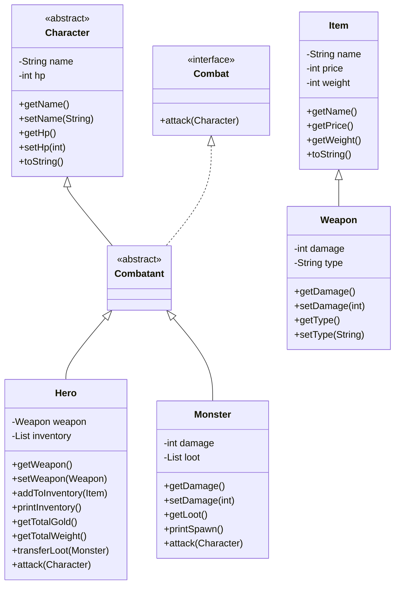
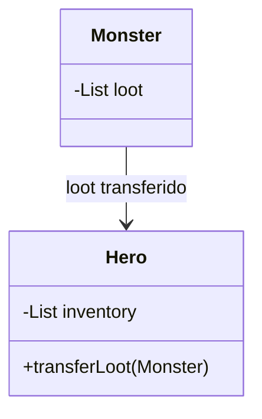

# 🗡️ Proyecto RPG — Los 4 Pilares de la POO + Colecciones en Java

Este proyecto es un juego de rol (RPG) por consola desarrollado en Java. Su propósito es ilustrar de forma práctica los **4 pilares de la Programación Orientada a Objetos (POO)** y el uso de **colecciones con `ArrayList`**:

1. [Encapsulamiento](#1️⃣-encapsulamiento)
2. [Herencia](#2️⃣-herencia)
3. [Polimorfismo](#3️⃣-polimorfismo)
4. [Abstracción](#4️⃣-abstracción)
5. [Colecciones](#-colecciones--arraylist)

---

## 🗂️ Estructura del proyecto

```
rpg/
└── src/
    ├── Main.java
    └── game/
        ├── Character.java   ← Clase base abstracta
        ├── Combatant.java   ← Clase intermedia abstracta
        ├── Combat.java      ← Interfaz de combate
        ├── Hero.java        ← Personaje jugable con inventario
        ├── Monster.java     ← Enemigo con loot
        ├── Item.java        ← Objeto base (nombre, precio, peso)
        ├── Weapon.java      ← Arma (extiende Item)
        └── Encounter.java   ← Gestiona el combate y transferencia de loot
```

---

## 🏗️ Desarrollo paso a paso desde cero

### Paso 1 — `Item.java`: La base de los objetos del mundo

Lo primero que necesitamos es representar cualquier **objeto** del mundo del juego. Todo ítem tiene un nombre, un precio y un peso.

```java
package game;

public class Item {
    private String name;
    private int price;
    private int weight;

    public Item(String name, int price, int weight) {
        this.name = name;
        this.price = price;
        this.weight = weight;
    }

    public String getName() { return name; }
    public int getPrice() { return price; }
    public int getWeight() { return weight; }

    @Override
    public String toString() {
        return name + " (precio: " + price + ", peso: " + weight + ")";
    }
}
```

> 🔒 **ENCAPSULAMIENTO:** Todos los atributos son `private`. Solo se pueden leer a través de getters.

---

### Paso 2 — `Weapon.java`: Especializando un ítem

Una espada no es solo un ítem genérico, también tiene daño y tipo. Creamos `Weapon` extendiendo `Item`.

```java
package game;

public class Weapon extends Item {
    private int damage;
    private String type;

    public Weapon(String name, int price, int damage) {
        super(name, price, 1);       // Peso por defecto: 1
        this.damage = damage;
        this.type = "NEUTRAL";
    }

    public Weapon(String name, int price, int damage, String type) {
        super(name, price, 1);
        this.damage = damage;
        this.type = type;
    }

    public int getDamage() { return damage; }
    public void setDamage(int damage) { this.damage = damage; }

    public String getType() { return type; }
    public void setType(String type) { this.type = type; }
}
```

> 🧬 **HERENCIA:** `Weapon extends Item` hereda `name`, `price` y `weight`. Usa `super(name, price, 1)` para llamar al constructor del padre.

---

### Paso 3 — `Character.java`: La base de todos los personajes

Todo personaje del juego (héroe o monstruo) tiene un **nombre** y puntos de vida (**HP**). Creamos una clase abstracta que servirá de base para todos.

```java
package game;

public abstract class Character {
    private String name;
    private int hp;

    public Character(String name) {
        this.name = name;
        this.hp = 10;
    }

    public Character(String name, int hp) {
        this.name = name;
        this.hp = hp;
    }

    public String getName() { return name; }
    public void setName(String name) { this.name = name; }

    public int getHp() { return hp; }
    public void setHp(int hp) { this.hp = hp; }

    @Override
    public String toString() {
        return "Character{name='" + name + "', hp=" + hp + '}';
    }
}
```

> 🔒 **ENCAPSULAMIENTO:** `name` y `hp` son `private`, protegidos por getters y setters.

> 🧩 **ABSTRACCIÓN:** La clase es `abstract`. No tiene sentido crear un `Character` genérico; solo existen héroes y monstruos concretos.

---

### Paso 4 — `Combat.java`: Definir el contrato de combate

Antes de crear combatientes, definimos **qué capacidad** debe tener cualquier entidad que pueda luchar: atacar. Esto lo hacemos con una **interfaz**.

```java
package game;

public interface Combat {
    void attack(Character character);
}
```

> 🧩 **ABSTRACCIÓN:** La interfaz define el **"qué"** (atacar a un personaje), pero no el **"cómo"**. Cada clase que la implemente decidirá su propio comportamiento.

---

### Paso 5 — `Combatant.java`: El puente entre personaje y combatiente

`Combatant` es la clase que une a `Character` (ser vivo con nombre y HP) con `Combat` (capacidad de atacar). Es abstracta porque aún no sabemos si será héroe o monstruo.

```java
package game;

public abstract class Combatant extends Character implements Combat {

    public Combatant(String name) {
        super(name);
    }

    public Combatant(String name, int hp) {
        super(name, hp);
    }
}
```

> 🧬 **HERENCIA:** `Combatant` hereda de `Character` e implementa `Combat`.

> 🧩 **ABSTRACCIÓN:** Sigue siendo `abstract` porque no implementa `attack()`. Eso queda para `Hero` y `Monster`.

---

### Paso 6 — `Hero.java`: El personaje jugable

El héroe es un combatiente que puede equiparse con un arma y tiene un inventario de items. Su forma de atacar depende de si tiene arma o no.

```java
package game;

import java.util.ArrayList;

public class Hero extends Combatant {
    private Weapon weapon;
    private ArrayList<Item> inventory;

    public Hero(String name) {
        super(name);
        this.inventory = new ArrayList<>();
    }

    public Weapon getWeapon() { return weapon; }
    public void setWeapon(Weapon weapon) { this.weapon = weapon; }

    public void addToInventory(Item item) { inventory.add(item); }

    public void printInventory() {
        System.out.println("--- Inventario de " + getName() + " ---");
        if (inventory.isEmpty()) {
            System.out.println("El inventario está vacío.");
        } else {
            for (Item item : inventory) {
                System.out.println("- " + item);
            }
        }
    }

    public int getTotalGold() {
        int total = 0;
        for (Item item : inventory) {
            total += item.getPrice();
        }
        return total;
    }

    public int getTotalWeight() {
        int total = 0;
        for (Item item : inventory) {
            total += item.getWeight();
        }
        return total;
    }

    public void transferLoot(Monster monster) {
        ArrayList<Item> loot = monster.getLoot();
        if (loot != null && !loot.isEmpty()) {
            inventory.addAll(loot);
            System.out.println(getName() + " recogió " + loot.size() + " items del monstruo.");
        }
    }

    @Override
    public void attack(Character character) {
        if (weapon != null) {
            int damage = weapon.getDamage();
            character.setHp(character.getHp() - damage);
            System.out.println(getName() + " ataca a " + character.getName() +
                " con " + weapon.getType() + " y realiza " + damage + " daño.");
        } else {
            character.setHp(character.getHp() - 1);
            System.out.println(getName() + " ataca sin arma y hace 1 de daño.");
        }
    }
}
```

> 🧬 **HERENCIA:** `Hero extends Combatant` hereda todo de la cadena.

> 🔄 **POLIMORFISMO:** `attack()` tiene lógica propia: usa el arma equipada o hace daño mínimo.

> 📦 **COLECCIONES:** `inventory` es un `ArrayList<Item>`. El héroe puede agregar items, recorrerlos y sumar su valor.

---

### Paso 7 — `Monster.java`: El enemigo

El monstruo es otro combatiente. Tiene un daño fijo y lleva un inventario de **loot** que el héroe puede recoger al derrotarlo.

```java
package game;

import java.util.ArrayList;

public class Monster extends Combatant {
    private int damage;
    private ArrayList<Item> loot;

    public Monster(String name, int hp, int damage, ArrayList<Item> loot) {
        super(name, hp);
        this.damage = damage;
        this.loot = loot;
    }

    public int getDamage() { return damage; }
    public void setDamage(int damage) { this.damage = damage; }

    public ArrayList<Item> getLoot() { return loot; }

    public void printSpawn() {
        System.out.println("¡Cuidado! Un " + this.getName() +
            " ha aparecido con " + this.getHp() + " HP.");
    }

    @Override
    public void attack(Character character) {
        character.setHp(character.getHp() - damage);
        System.out.println(getName() + " ataca a " + character.getName() +
            " y realiza " + damage + " daño.");
    }
}
```

> 🔄 **POLIMORFISMO:** `attack()` aplica daño fijo directo, sin verificar armas.

> 📦 **COLECCIONES:** `loot` es un `ArrayList<Item>` pasado por parámetro en el constructor.

---

### Paso 8 — `Encounter.java`: El escenario del combate

Esta clase gestiona el enfrentamiento entre dos combatientes. Cuando el héroe gana, el loot del monstruo se transfiere a su inventario.

```java
package game;

public class Encounter {
    private Combatant combatant1;
    private Combatant combatant2;

    public Encounter(Combatant combatant1, Combatant combatant2) {
        this.combatant1 = combatant1;
        this.combatant2 = combatant2;
    }

    public Combatant getCombatant1() { return combatant1; }
    public void setCombatant1(Combatant combatant1) { this.combatant1 = combatant1; }

    public Combatant getCombatant2() { return combatant2; }
    public void setCombatant2(Combatant combatant2) { this.combatant2 = combatant2; }

    public void startCombat() {
        while (combatant1.getHp() > 0 && combatant2.getHp() > 0) {
            combatant1.attack(combatant2);
            if (combatant2.getHp() <= 0) {
                System.out.println(combatant1.getName() + " gana la batalla!");
                if (combatant1 instanceof Hero && combatant2 instanceof Monster) {
                    ((Hero) combatant1).transferLoot((Monster) combatant2);
                }
                break;
            }
            combatant2.attack(combatant1);
            if (combatant1.getHp() <= 0) {
                System.out.println(combatant2.getName() + " gana la batalla!");
                break;
            }
        }
    }
}
```

> 🔄 **POLIMORFISMO + `instanceof`:** `combatant1.attack()` funciona sin saber si es `Hero` o `Monster`. El `instanceof` permite acceder a funcionalidades específicas tras el combate.

---

### Paso 9 — `Main.java`: El punto de entrada

Aquí se ensambla todo el proyecto con dos batallas consecutivas.

```java
import game.*;

import java.util.ArrayList;
import java.util.Scanner;

void main() {
    Scanner scanner = new Scanner(System.in);
    System.out.print("Ingresa el nombre de tu Heroe: ");
    String name = scanner.nextLine();

    Hero hero = new Hero(name);
    Weapon weapon = new Weapon("Espada de Acero", 100, 5);
    hero.setWeapon(weapon);

    System.out.println("¡Bienvenido, " + hero.getName() + "! Tu aventura comienza ahora.");

    ArrayList<Item> goblinLoot = new ArrayList<>();
    goblinLoot.add(new Item("Monedas de oro", 25, 1));
    goblinLoot.add(new Item("Poción de vida", 15, 2));

    Monster monster1 = new Monster("Goblin", 20, 1, goblinLoot);
    monster1.printSpawn();

    Encounter encounter = new Encounter(hero, monster1);
    encounter.startCombat();

    System.out.println();
    hero.printInventory();
    System.out.println("Oro total: " + hero.getTotalGold());
    System.out.println("Peso total: " + hero.getTotalWeight());

    System.out.println();
    System.out.println("=== ¡Una nueva amenaza aparece! ===");
    hero.setHp(50);
    System.out.println(hero.getName() + " se cura a " + hero.getHp() + " HP.");

    ArrayList<Item> dragonLoot = new ArrayList<>();
    dragonLoot.add(new Item("Escamas de dragón", 150, 5));
    dragonLoot.add(new Item("Gema rubí", 200, 1));
    dragonLoot.add(new Item("Poción de vida", 15, 2));

    Monster monster2 = new Monster("Dragón", 50, 4, dragonLoot);
    monster2.printSpawn();

    Encounter encounter2 = new Encounter(hero, monster2);
    encounter2.startCombat();

    System.out.println();
    System.out.println("--- Estado final ---");
    hero.printInventory();
    System.out.println("Oro total: " + hero.getTotalGold());
    System.out.println("Peso total: " + hero.getTotalWeight());
}
```

---

## 🧱 Resumen visual de los 4 pilares



---

## 📌 Tabla resumen de los 4 pilares

| Pilar | ¿Dónde aparece en el proyecto? |
|---|---|
| 🔒 **Encapsulamiento** | Todos los atributos son `private` en todas las clases. Se acceden con *getters/setters*. |
| 🧬 **Herencia** | `Weapon → Item`, `Combatant → Character`, `Hero → Combatant`, `Monster → Combatant`. |
| 🔄 **Polimorfismo** | `Hero` y `Monster` implementan `attack()` de forma diferente. `Encounter` los usa sin distinguir cuál es cuál. |
| 🧩 **Abstracción** | `Character` y `Combatant` son clases `abstract`. `Combat` es una `interface`. Ninguna puede instanciarse directamente. |

---

## 📦 Colecciones — ArrayList

Java ofrece el **Java Collections Framework** para almacenar y manipular grupos de objetos. `ArrayList` es la implementación más usada de la interfaz `List`: un array redimensionable que crece automáticamente.

### ¿Por qué ArrayList en lugar de arrays normales?

| Array normal (`Item[]`) | ArrayList (`ArrayList<Item>`) |
|---|---|
| Tamaño fijo al crearlo | Tamaño dinámico, crece y decrece |
| Sin métodos de búsqueda o manipulación | Métodos como `.add()`, `.remove()`, `.contains()`, `.size()` |
| Iteración manual con índice | Soporta `for-each` y Streams de forma nativa |

### Uso en el proyecto

#### 1. Importar la clase

```java
import java.util.ArrayList;
```

#### 2. Crear un ArrayList y agregar elementos

```java
ArrayList<Item> loot = new ArrayList<>();
loot.add(new Item("Monedas de oro", 25, 1));
loot.add(new Item("Poción de vida", 15, 2));
```

> El `<>` vacío se llama **diamond operator** (Java 7+). Java infiere el tipo a partir de la declaración.

#### 3. Recorrer la colección con *for-each*

En `Hero.java`, el método `getTotalGold()` recorre el inventario sumando precios:

```java
public int getTotalGold() {
    int total = 0;
    for (Item item : inventory) {
        total += item.getPrice();
    }
    return total;
}
```

Este bucle se traduce como: *"para cada `item` dentro de `inventory`, haz..."*. Es más legible que usar un índice.

#### 4. Transferir elementos entre colecciones

Cuando el héroe gana la batalla, todos los items del monstruo pasan a su inventario usando `.addAll()`:

```java
public void transferLoot(Monster monster) {
    ArrayList<Item> loot = monster.getLoot();
    if (loot != null && !loot.isEmpty()) {
        inventory.addAll(loot);
    }
}
```

> `.addAll()` copia **todos** los elementos de una colección a otra en una sola operación.

#### 5. Métodos clave de ArrayList usados en el proyecto

| Método | Descripción | Ejemplo |
|---|---|---|
| `.add(item)` | Agrega un elemento al final | `inventory.add(item)` |
| `.addAll(collection)` | Agrega todos los elementos de otra colección | `inventory.addAll(loot)` |
| `.size()` | Retorna la cantidad de elementos | `loot.size()` |
| `.isEmpty()` | Retorna `true` si no tiene elementos | `inventory.isEmpty()` |
| `.get(index)` | Retorna el elemento en la posición dada | `inventory.get(0)` |
| `.remove(index)` | Elimina el elemento en la posición dada | `inventory.remove(0)` |

### Diagrama de flujo del inventario



Al derrotar un monstruo, su `ArrayList<Item> loot` se transfiere al `ArrayList<Item> inventory` del héroe.
